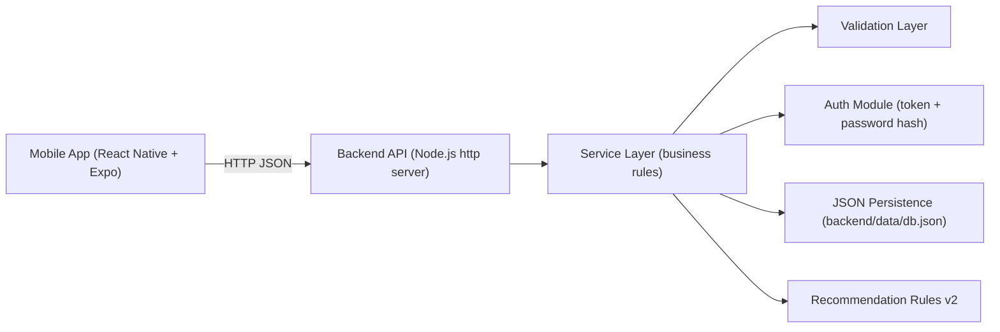

# Final Report Technical Sections + Architecture

Owner scope: `[DOC]` (`SCRUM-36`)

## 1) System Overview

HealthyLifeHappyLife is a Month 1 MVP with React Native mobile client and Node.js backend. It provides account management, daily tracking, and lightweight recommendation support for wellness consistency.

## 2) Technical Architecture

## 3) Backend Design Notes

- Route handling is centralized in `backend/src/server.js`.
- Core logic sits in `backend/src/services.js`.
- Validation helpers are in `backend/src/validation.js`.
- Auth utilities use `crypto.scrypt` for password hashing and HMAC-signed token format.
- Persistence is file-based JSON for MVP speed.

## 4) Data Model (MVP)

Primary collections:

- `users`
- `profiles`
- `meals`
- `workouts`
- `reminders`
- `follows`
- `counters`

This model enables full user-level scoping without external database dependency.

## 5) Recommendation Module (Technical)

- Daily recommendations are rule-based.
- Rules consume dashboard summary (calories, macros, workout volume, goals).
- Outputs include fixed non-medical disclaimer.
- Tip output is bounded and priority-ranked.
- Edge-case matrix and privacy checks are covered in automated tests.

## 6) Test and Verification Strategy

- `node --test` covers service-level behavior.
- Regression currently includes:
  - auth token and password checks
  - reminders update flow
  - recommendation safety and edge cases
  - social follow/unfollow behavior
  - privacy checks on output payloads

## 7) Known Technical Limitations

- File persistence instead of relational DB
- No CI pipeline yet
- No token revocation/refresh lifecycle
- Limited route-level/network integration tests compared to production standards

## 8) Final Submission Position

As of 2026-05-10, the system is runnable, test-backed for core behaviors, and ready to support the final delivery phase with documentation and demo packaging.
